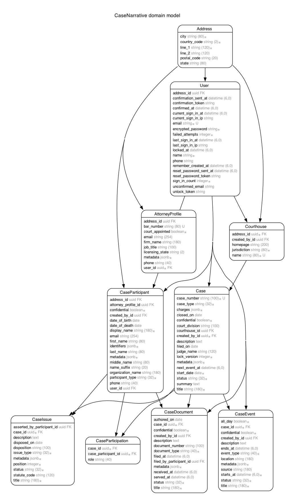

# README

CaseNarrative is a timeline-based application that helps defendants and attorneys document, organize, and understand events in a legal case. It presents a chronological narrative with supporting exhibits, allowing users to clearly reconstruct what happened and build a structured, evidence-backed case.


Live - https://casenarrative.com

# Model

Generated by Rails ERD. Run rails erd to regenerate (must have graphviz).


# Versions

- ruby 4.0.6
- Rails 8.1.3.1

# Deployment Requirements and Instructions

(To be added)

# TODO

- Build core models (Case, Event, Exhibit)
- Implement timeline UI with dynamic data
- Add authentication (Devise)
- Add file uploads (Active Storage)
- Add rich text editor for narratives
- Add event linking and references
- Add export to PDF functionality
- Add gems:
  - gem "devise" # Authentication (users, attorneys, defendants)
  - gem "devise_invitable" # Invite users (attorney invites defendant)
  - gem "pundit" # Authorization (roles, permissions, access control)
  - gem "pg_search" # Full-text search using PostgreSQL
  - gem "validates_timeliness" # Validate dates and date ranges
  - gem "paper_trail" # Track changes (who edited what and when)
  - gem "bullet" # Detect N+1 queries
  - gem "rack-mini-profiler" # Performance profiling
  - gem "rspec-rails" # Testing framework
  - gem "factory_bot_rails" # Test data factories
  - gem "simplecov", require: false # Test coverage

# Dev: How To

## Use `mise-bundle`

[`bin/mise-bundle`](bin/mise-bundle) is a small Bundler wrapper that runs `bundle` with the Ruby version pinned in `mise.toml`. Use it when you want Bundler commands to use the project's Ruby without activating mise in the current shell first. Every argument is forwarded directly to Bundler.

```sh
# Install the gems from Gemfile.lock
bin/mise-bundle install

# Run a command provided by a bundled gem
bin/mise-bundle exec rails test
bin/mise-bundle exec rubocop
bin/mise-bundle exec erb_lint --lint-all

# Update one gem and its permitted dependencies
bin/mise-bundle update GEM_NAME

# Verify that Gemfile.lock satisfies Gemfile
bin/mise-bundle check
```

For example, `bin/mise-bundle exec rubocop` is equivalent to:

```sh
mise exec -- bundle exec rubocop
```

VS Code's ERB beautifier is configured to use this wrapper automatically, so editor formatting also runs against the project's mise-managed Ruby and bundle.

## Update package.json

```sh
bun update --latest
```

## Format and Linting

The application uses the following development tools:

| Files                                            | Formatter      | Linter            | Responsibility                                                                                                                                                      |
| ------------------------------------------------ | -------------- | ----------------- | ------------------------------------------------------------------------------------------------------------------------------------------------------------------- |
| HTML, JavaScript, JSON, YAML, Markdown, and SCSS | Prettier       | —                 | Applies consistent whitespace, indentation, wrapping, and general layout.                                                                                           |
| JavaScript                                       | Prettier       | ESLint            | Prettier controls layout; ESLint finds JavaScript mistakes and unsafe or suspicious patterns.                                                                       |
| SCSS and CSS embedded in HTML                    | Prettier       | Stylelint         | Prettier controls general layout; Stylelint checks CSS correctness and applies the project's comma-list conventions.                                                |
| HTML+ERB                                         | htmlbeautifier | Herb and erb_lint | htmlbeautifier controls layout; Herb provides live editor diagnostics; erb_lint enforces ERB, HTML, accessibility, and embedded Ruby conventions in the CLI and CI. |
| Ruby                                             | RuboCop        | RuboCop           | RuboCop provides both Ruby formatting corrections and static analysis using Rails Omakase rules.                                                                    |

Formatters and linters solve different problems. A formatter rewrites presentation—spacing, indentation, wrapping, and line breaks—without deciding whether the code is logically sound. A linter analyzes the code for errors, questionable constructs, framework conventions, and project-specific rules. Using both is intentional: formatting makes the code consistent, while linting helps make it correct and maintainable.

For SCSS and embedded CSS, Stylelint performs a small formatting pass after Prettier. This preserves comma-separated selectors and values on one line, which is an explicit project convention that Prettier cannot configure by itself. VS Code uses the same order on save: Prettier formats first, then the Stylelint save action runs.

Plain HTML also uses `@awmottaz/prettier-plugin-void-html`, which makes Prettier emit modern void elements such as `<meta>` and `<br>` without XHTML-style trailing slashes. The plugin applies only to `.html` files; ERB remains formatted by htmlbeautifier.

### ERB toolchain

ERB uses three complementary tools:

- **htmlbeautifier** is the formatter. It controls indentation and HTML layout around ERB tags and preserves one intentional blank line.
- **Herb** is enabled as a VS Code linter. It provides immediate HTML-aware ERB diagnostics while editing, including malformed, mismatched, or unclosed tags. Herb's experimental formatter is intentionally disabled so it does not compete with htmlbeautifier.
- **erb_lint** is the repository and CI linter. It provides repeatable Rails-oriented checks from the command line, including ERB, HTML, accessibility, and embedded Ruby conventions.

In short, Herb gives fast feedback in the editor, while erb_lint provides the authoritative check that also runs outside VS Code.

```sh
# Format HTML, JavaScript, SCSS, JSON, YAML, Markdown, and HTML+ERB
mise exec -- bun run format

# Verify formatting without changing files
mise exec -- bun run format:check

# Run JavaScript and SCSS linting
mise exec -- bun run lint

# Lint all ERB templates
mise exec -- bundle exec erb_lint --lint-all
mise exec -- bundle exec erb_lint --lint-all --autocorrect

# Format only HTML+ERB templates
mise exec -- bun run format:erb
```

## Run the Rails CI workflow

[`config/ci.rb`](config/ci.rb) declares the project's complete Rails CI workflow. [`bin/ci`](bin/ci) loads that file through `ActiveSupport::ContinuousIntegration`, sets `CI=true`, runs every declared step, displays the command and elapsed time for each step, and prints a final pass/fail summary. A failed step does not prevent the remaining steps from running, so one invocation can reveal multiple problems. After all steps finish, `bin/ci` exits with a nonzero status if any step failed.

Run the complete workflow from the project root:

```sh
mise exec -- bin/ci
```

If mise is already activated in the shell, this is sufficient:

```sh
bin/ci
```

The workflow performs these steps in order:

| Step                        | Command                                                          | Purpose                                                                                                     |
| --------------------------- | ---------------------------------------------------------------- | ----------------------------------------------------------------------------------------------------------- |
| Setup                       | `bin/setup --skip-server`                                        | Installs missing Ruby and Bun dependencies, prepares the database, and clears old logs and temporary files. |
| Style: Ruby                 | `bin/rubocop`                                                    | Checks Ruby using the Rails Omakase RuboCop rules.                                                          |
| Style: ERB                  | `bundle exec erb_lint --lint-all`                                | Checks ERB templates and their HTML structure without autocorrecting files.                                 |
| Style: Frontend formatting  | `bun run format:check`                                           | Verifies frontend and ERB formatting without rewriting files.                                               |
| Lint: JavaScript            | `bun run lint:js`                                                | Runs ESLint against the application's JavaScript.                                                           |
| Lint: SCSS                  | `bun run lint:css`                                               | Runs Stylelint against SCSS and CSS embedded in public HTML.                                                |
| Assets: JavaScript          | `bun run build`                                                  | Compiles JavaScript and verifies that its source map can be generated.                                      |
| Assets: CSS                 | `bun run build:css`                                              | Compiles Sass, runs Autoprefixer, and verifies that CSS source maps can be generated.                       |
| Security: Gem audit         | `bin/bundler-audit`                                              | Checks locked Ruby dependencies against the configured vulnerability database.                              |
| Security: Brakeman analysis | `bin/brakeman --quiet --no-pager --exit-on-warn --exit-on-error` | Scans Rails code for security problems and treats warnings and errors as CI failures.                       |
| Tests: Rails                | `bin/rails test`                                                 | Runs the Rails test suite.                                                                                  |
| Tests: Seeds                | `env RAILS_ENV=test bin/rails db:seed:replant`                   | Replants the test database seeds to confirm that seed data can be loaded from scratch.                      |

The setup step can install dependencies, prepare a local database, and clear temporary files; later build steps regenerate compiled assets. Commit or stash unrelated work before using the workflow when you need an absolutely clean working tree. PostgreSQL and the other development prerequisites must also be available locally.

To troubleshoot one failure more quickly, run the command shown for that step directly. `bin/ci` does not currently provide a built-in option to select only one step.

### GitHub Actions relationship

The current [`.github/workflows/ci.yml`](.github/workflows/ci.yml) does **not** invoke `bin/ci`. It defines independent security, Ruby lint, Rails test, and system-test jobs. Therefore, changing `config/ci.rb` changes the local `bin/ci` workflow but does not automatically change the GitHub Actions jobs. Keep both files synchronized when adding checks, or update GitHub Actions to call `bin/ci` if one shared workflow is preferred.

System tests and GitHub signoff are present as commented examples in `config/ci.rb`. They do not run unless those lines are enabled. GitHub signoff also requires the `gh` CLI and the `basecamp/gh-signoff` extension.

# References
